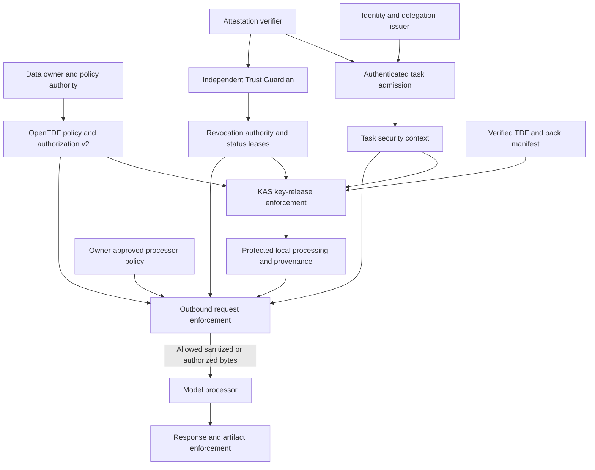

# Swarm trust model for sealed knowledge

**Date:** 2026-09-26

**Status:** Proposed architecture and implementation contract; not a claim of implemented enforcement.

**Scope:** Arkavo Edge, the deployed Arkavo platform (`arkavo-rs` in front of the `opentdf-platform` fork), `authnz-rs` (identity.arkavo.net), `opentdf-rs`, and their identity/attestation integration.

**Design input:** the outbound prompt gate for sealed knowledge, designed 2026-09-26. The "Changes required in the outbound design" section summarizes each proposal it revises, so this document stands on its own.

**Code baseline:** `arkavo-edge` commit `c46e4260a6bceb11b545c7afde28fc09a44f7f8e`, plus the open semantic-tier PR #695 (embedding tier and `arkavo chat --pack`).

## Decision

Use data-centric zero trust with explicit delegation and action-specific authorization. Authenticate each caller, establish whose authority it exercises, evaluate the data owner's policy, and enforce the decision at every plaintext boundary. Trust scores are evidence that can restrict an authorized action; scores cannot create authority.

Autonomous role work is in scope now. An independently enrolled **Trust Guardian** appraises the executing agent and can quarantine it, including when that agent is the Orchestrator. Owner-authorized workload grants plus current independent appraisal can permit protected processing. Self-grading remains forbidden; a peers-only restriction is unnecessary. A hard deny state overrides every score, role grant and task snapshot.

For cloud inference, authorize three distinct parties: the originating principal, the agent executing the task, and the processor receiving plaintext. Permission for a peer to read a document does not imply permission to send that document to its preferred model provider.

OpenTDF provides encrypted packaging, policy binding, attribute-based decisions, and key-release enforcement. Arkavo provides task scope, delegation constraints, runtime evidence, destination approval, provenance, and enforcement after decryption. Neither TDF nor a classifier can retract plaintext already disclosed to an authorized but compromised endpoint.

This applies [NIST SP 800-207](https://csrc.nist.gov/pubs/sp/800/207/final) and the application/workload focus of [SP 800-207A](https://csrc.nist.gov/pubs/sp/800/207/a/final). The detailed contracts below are proposed Arkavo policy, not requirements claimed to come from those publications.

## Security boundary and assumptions

Protect sealed corpora, pack/index keys, decrypted role bundles, conversation state, memory, derived artifacts, tool results, and audit metadata. Treat peers, orchestrators, retrieved content, model output, and network discovery as potentially malicious. Model instructions never modify security policy.

The protected boundary includes the agent's reference monitor, its credential broker, policy evaluator, pack registry, and outbound transport. Code execution tools must run with filesystem and network isolation appropriate to the data they can read. A shell with unrestricted network access can bypass an in-process provider wrapper; a prompt gate alone does not establish swarm-wide confinement.

Enforcement comes in two threat tiers, and each delivery states which one it reaches:

- **Honest worker.** An in-process request gate on the provider wrapper stops accidental leaks and prompt-injection-driven leaks through model sends from an agent whose process is not compromised. It cannot stop a compromised worker that holds provider credentials or a network path of its own.
- **Compromised worker.** Provider credentials and model egress live in a credential and egress broker outside the worker's process and OS user. The broker holds the API keys and accepts only single-use send permits. Role bundles stop delivering provider tokens to the worker; today `AgentSpecializationBundle.api_tokens` is copied into the worker's `AgentMetadata.api_keys`.

The ordinary deployment assumes the host OS and enforcement process remain trustworthy after key release. A malicious host administrator can read process memory or replace the gate. KAS controls future key release, but cannot prevent that administrator from retaining a released key or plaintext. To exclude the host administrator from the trusted boundary, keep plaintext in a separately trusted service or an attested confidential-computing environment with evidence-bound key release and constrained egress. TPM possession, an App Attest assertion, and a passkey login do not individually prove that protection.

| Threat | Required control | Remaining limit |
|---|---|---|
| Peer invents a DID or high score | Proof of key possession, authorized issuer, subject binding, evidence validation | A legitimate credential can still operate maliciously |
| Orchestrator assigns itself a powerful role | Owner-authorized grant ceiling; role assignment only narrows it | An explicitly authorized grant administrator is trusted within that ceiling |
| Agent forwards another agent's token | Downstream token exchange, audience restriction, sender binding | Key compromise requires revocation and containment |
| Tool output instructs the agent to upload secrets | Provenance, action authorization, final outbound check, tool isolation | Content detection has false negatives |
| New swarm inherits old plaintext | Retain protection; isolate state; bind new grants to owner and swarm context | Untracked exports cannot be recalled |
| Attacker replays an older signed registry | Monotonic state anchored outside the editable registry | A signature alone does not establish recency |
| Cloud provider retains an allowed prompt | Explicit owner approval of processor and processing terms | Contractual retention claims are not cryptographic enforcement |

## Standards baseline

These versions/statuses were checked on 2026-09-26. Pin concrete protocol and schema revisions in implementation; do not make a moving `latest` URL a compatibility target.

| Concern | Baseline | Application |
|---|---|---|
| Human enrollment and authentication | [NIST SP 800-63-4](https://csrc.nist.gov/pubs/sp/800/63/4/final), final July 2025 | Separate human assurance from workload identity and device posture. Passkey authentication does not itself grant corpus access. |
| OAuth security | [RFC 9700](https://www.rfc-editor.org/rfc/rfc9700.html), BCP 240, January 2025; [RFC 8725](https://www.rfc-editor.org/rfc/rfc8725.html) | Issuer, audience, algorithm and token-type validation; secure authorization flows; prevent token confusion. |
| Delegation | [RFC 8693](https://www.rfc-editor.org/rfc/rfc8693.html) | Exchange credentials for downstream authority; preserve subject and current actor. Arkavo separately enforces attenuation. |
| Token format and scope | [RFC 9068](https://www.rfc-editor.org/rfc/rfc9068.html), [RFC 8707](https://www.rfc-editor.org/rfc/rfc8707.html), [RFC 9396](https://www.rfc-editor.org/rfc/rfc9396.html) | JWT access-token profile, resource audiences, structured authorization details. Arkavo defines its own namespaced detail type. |
| Sender constraint | [RFC 9449](https://www.rfc-editor.org/rfc/rfc9449.html) or [RFC 8705](https://www.rfc-editor.org/rfc/rfc8705.html) | DPoP for supported HTTP paths, or certificate-bound access tokens with mTLS. |
| Discovery | [RFC 9728](https://www.rfc-editor.org/rfc/rfc9728.html), April 2025 | Protected-resource metadata. Discover capabilities automatically while validating issuer and endpoint trust. |
| Attestation | [RATS, RFC 9334](https://www.rfc-editor.org/rfc/rfc9334.html); [EAT, RFC 9711](https://www.rfc-editor.org/rfc/rfc9711.html), April 2025 | Distinct attester, verifier and relying-party roles; an explicit EAT profile for interoperable claims. |
| Continuous access evaluation | [OpenID SSF 1.0](https://openid.net/specs/openid-sharedsignals-framework-1_0.html) and [CAEP 1.0](https://openid.net/specs/openid-caep-1_0.html), Final Specifications approved September 2025 | Authenticated security signals and session-revocation notifications; Arkavo defines workload quarantine and freshness semantics. |
| Revocation enforcement | [RFC 7662](https://www.rfc-editor.org/rfc/rfc7662.html), [RFC 7009](https://www.rfc-editor.org/rfc/rfc7009.html), [RFC 8935](https://www.rfc-editor.org/rfc/rfc8935.html) | Active-token checks, credential revocation and pushed Security Event Token delivery. An offline JWT signature alone does not establish current authorization. |
| Compact credentials | [CWT, RFC 8392](https://www.rfc-editor.org/rfc/rfc8392.html); [COSE, RFC 9052](https://www.rfc-editor.org/rfc/rfc9052.html) | Preserve the existing compact identity path, with explicit issuer, audience, type and proof-of-possession rules. A CWT is not automatically an EAT. |
| Managed workload identity | [SPIFFE specifications](https://spiffe.io/docs/latest/spiffe-about/overview/) | Optional SVID integration where a workload identity authority exists; not required to run a personal edge swarm. |
| Data authorization | [OpenTDF Authorization v2](https://opentdf.io/components/authorization), [subject mappings](https://opentdf.io/components/policy/subject_mappings), [KAS](https://opentdf.io/components/key_access) | Attribute values, action-specific subject mappings, authorization decisions, obligations and key release. |
| Agent interoperability | [A2A 1.0.0](https://a2a-protocol.org/v1.0.0/specification/) | Authenticated operations, scoped task access, declared security schemes and version negotiation. Existing `message/send` is a legacy seam. |
| Tool interoperability | [MCP 2026-07-28 authorization](https://modelcontextprotocol.io/specification/2026-07-28/basic/authorization) | Resource-specific credentials, issuer isolation, discovery and scope handling. Do not pass upstream credentials through to tools. |
| Signed JSON artifacts | [JCS, RFC 8785](https://www.rfc-editor.org/rfc/rfc8785.html) | Canonical signed manifests and receipts; reject duplicate/ambiguous keys and define the exact signed envelope. |

[OAuth 2.1 revision 16](https://datatracker.ietf.org/doc/draft-ietf-oauth-v2-1/16/) is still an Internet-Draft. Track it for interoperability without describing it as a finalized RFC. [W3C Verifiable Credentials 2.0](https://www.w3.org/TR/vc-data-model-2.0/) is a Recommendation and can carry external organizational credentials if needed; it is not required in the initial hot path. MCP-T scores and the proposed Arkavo swarm claims remain application-specific profiles.

Standards needed by each delivery (see "Delivery and acceptance"):
- **Pack provisioning and baseline outbound enforcement:** none beyond those already in use (OpenTDF, CWT/COSE).
- **Identity and policy contract:** RFC 8693, RFC 8707, RFC 9068, RFC 8725, and RFC 9449 or RFC 8705.
- **Guardian containment:** SSF 1.0, CAEP 1.0 and RFC 8935.
- **Attestation evidence:** RFC 9334 and RFC 9711.
- **Optional:** SPIFFE, RFC 9396 and VC 2.0 wherever a deployment needs them. JCS is required only once signed JSON receipts are introduced.

## Principals and authority

Every operation has a structured security context. A display name, an Agent Card, a role label, or a DID string supplied in a message is not that context.

| Principal | Authority it may hold | Authority it does not acquire automatically |
|---|---|---|
| Data owner / attribute authority | Classify data; appoint grant issuers; approve processors; define release constraints | Administrative control over every execution host |
| Human or organization principal | Delegate an allowed task to an agent | Permission to re-share all data that an agent can decrypt |
| Swarm author / orchestrator | Assign roles within an owner-authorized ceiling | Grant arbitrary owner attributes or weaken retained packs |
| Agent workload | Execute scoped tasks using its own authenticated key | Its user's full privileges or its host administrator's rights |
| Attestation verifier | Appraise evidence against reference values and issue results | Authorize data release just by reporting a healthy device |
| Trust Guardian | Independently appraise enrolled agents; issue scoped quarantine signals from attributable evidence | Create data entitlements, approve its own workload, or restore access on its own after quarantine |
| Swarm authz agent | Hold one share of each intra-swarm key and release it under owner-signed policy | Release alone, act on the orchestrator's instruction, or be appointed or reassigned by the orchestrator |
| Local trust service | Report attributable observations about peers | Convert peer popularity, competence or tenure into clearance |
| Model/tool processor | Receive only data approved for that endpoint and action | Inherit the requester's permissions |
| KAS / policy service | Release keys and decide permitted operations under owner policy | Guarantee behavior after plaintext leaves its controlled boundary |

Trust anchors are scoped by purpose: identity issuer, attestation verifier, pack signer, attribute/grant authority, and KAS. Being trusted in one role does not confer another. A signed SwarmKit can carry references to these anchors, but its signer cannot bootstrap itself as an authority over someone else's corpus. Initial anchors arrive through owner-authorized enrollment; capability discovery never invents them. This preserves automatic provisioning without treating first contact as permission to decrypt.

Map a key-based DID to a workload and owner through authenticated enrollment. In a SPIFFE deployment, maintain an explicit issuer-approved DID-to-SVID binding instead of assuming equivalent names identify the same workload. Key rotation changes that binding through an authorized transition; support revocation independently of the identifier syntax.

## Decisions are intersections

For a protected operation, permission requires all applicable predicates:

```text
Permit(operation) =
    authenticated actor and correct audience
  AND valid, non-revoked delegation for this operation
  AND owner-authorized grant for resource and action
  AND current swarm role within that grant's ceiling
  AND required runtime/evidence predicates
  AND current independent Guardian appraisal and no active quarantine
  AND data policy and every contributing pack's restrictions
  AND destination/processor approval when plaintext leaves
  AND enforceable obligations
  AND current policy, credential and revocation validity
```

An absent optional reputation condition contributes no extra restriction. An absent required grant, unknown attribute, incomplete provenance, unsupported mandatory policy, or unavailable freshness proof never becomes permission. Distinguish a definite denial from a transient inability to decide; both prevent protected bytes from being sent.

Define separate Arkavo actions, registered in the policy domain rather than assumed to be upstream built-ins:

| Action | Meaning |
|---|---|
| `decrypt` | Release the key needed to recover this protected resource |
| `process_local` | Use plaintext in the approved local execution boundary |
| `send_model` | Disclose plaintext to a named, approved model processor for the authorized purpose |
| `share_wrapped` | Deliver a TDF envelope under approved attributes and recipients |
| `delegate` | Issue narrower authority to another authenticated workload |
| `feedback_detail` | Disclose a specified level of diagnostic information |

Map `decrypt` to the pinned platform's configured KAS action. Do not assume a successful key rewrap or an attribute-only entitlement grants `send_model`. OpenTDF v2 supplies action-aware ABAC; Arkavo composes destination, task and delegation restrictions around that decision. Preserve `TaxonomyMap` as the sole label-to-attribute mapping in the agent, versioned against the owner's taxonomy. Do not duplicate hierarchy evaluation in the gate.

The policy request must retain the originator and acting workload. Model the processor as a subject in an appropriate policy decision or perform a separate processor decision and intersect it locally. Do not mark it merely as an environment entity and assume it was authorized; OpenTDF distinguishes subject entities from environment entities excluded from access decisions. Nor does putting several entities in a chain, by itself, express Arkavo's required relationship between originator, actor, purpose and processor.

## Delegation and task admission

Use token exchange at authority boundaries. A downstream token is issued for the receiving agent or service, identifies the originating subject and current actor, and binds the permitted resource/action set. The issuing authority enforces that child authority is a subset of parent authority. RFC 8693 supplies the exchange and actor representation; it does not implement this application-specific subset check for Arkavo.

The Arkavo authorization profile includes issuer, subject, current actor, audience, issued/expiry times, token identifier, confirmation key, owner/tenant, swarm flight, role-binding version, permitted resources, actions, processor policy reference, purpose, delegation depth and revocation epoch. Bind these restrictions to signed tokens or signed policy references, not caller-editable metadata. Each child narrows resources/actions/destinations, shortens or preserves expiry, and consumes delegation depth. Reject cycles, oversized chains and unrecognized issuers. The full delegation path remains auditable; prior actors are not independently reusable grants.

Keep the formats distinct. The current `arkavo-cwt` `act` array names human principals and is an Arkavo convention; RFC 8693's JWT `act` is an object naming the current actor, with optional nested prior actors. Do not silently reinterpret the existing array. Version the profile and define an explicit exchange/mapping that preserves originator, current actor, and delegation restrictions.

For HTTP, validate sender-constrained access tokens at the actual ingress using DPoP or mTLS. DPoP binds tokens to a key and method/URI proofs; it does not sign the request body. For queued or forwarded jobs, independently bind the task payload digest and scope to an authenticated job envelope. Iroh transport identity likewise needs an explicit binding to the authorized application principal.

Admission produces an immutable `TaskSecurityContext` with authenticated identity, validated delegation, role binding, policy references, trust/evidence snapshot and feedback ceiling. Carry it explicitly through conductor spawns and downstream work; a task-local facade can ease integration, but must not be the only durable source. A missing context gets anonymous/no-uplift handling. Invalid credentials on a protected endpoint are rejected, not downgraded to anonymous. Intentional public anonymous operations must have their own public-only policy.

Authenticate and authorize task reads, streams, cancellation, artifacts and push callbacks as well as task creation. A guessed task ID must not expose another principal's history. Carry a verified flight/tenant binding on the wire through a namespaced extension or token; the current role-to-DID lookup alone cannot disambiguate overlapping flights or replay after re-specialization. Migration may keep legacy public-only intake, but protected operations require the new context.

## Evidence and trust scores

Keep categorical evidence separate from numerical reputation. Required evidence can include an authenticated workload key, recent verifier-approved platform state, an approved binary/measurement, and a suitable execution boundary. A composite performance score cannot compensate for a missing hardware claim or revoked credential.

Follow the RATS division: the device supplies evidence; a trusted verifier checks endorsements, challenge freshness, reference values and key binding; the relying party applies its own policy to the resulting appraisal. Define the EAT profile's audience, nonce, supported claims, signing algorithms, freshness and verifier authority. Bind an attestation result to the same workload/session key receiving credentials or TDF keys, preventing evidence from a healthy device being replayed for another agent.

App Attest evidence must be appraised for its actual supported platform and claims. Software fingerprints, Secure Enclave presence, and local process self-reports remain lower-assurance evidence. They must never be normalized into verified hardware or measured-runtime claims merely because the structure has an `attestation_type` field.

Replace the outbound design's local-signer-only rule with an owner-enrolled, purpose-scoped assessor rule. The assessor must be independent of the subject, and its key and provider identity must be bound by the enrollment authority to the permitted subjects and policy domain. The signature must match that pinned identity; the subject must match the authenticated workload; the appraisal must be current and valid for this purpose. An existing local scorer can contribute observations about a peer, while an independently enrolled Guardian appraises this node's own role work. Arbitrary foreign scores, self-scores and a public key supplied only inside the score cannot unlock egress.

Validate every dimension used by a threshold: value range, finite confidence, minimum confidence, evidence count, event provenance and age. Reject empty conditions and `composite_min: 0` as authority gates; composite conditions must identify the component dimensions and evidence they depend on. Count independent observations, not duplicate signed events or multiple identities controlled by the same observer. Keep success/performance scoring useful for routing without treating it as a security credential.

Preserve no egress uplift from a self-score and no implicit uplift for a terminal operator. Autonomous role work may use a grant explicitly issued to the executing workload under the owner's authority, conditional on independent Guardian appraisal and the same data/processor constraints as a peer request. A role's `subject_mappings` can therefore apply to an explicitly bound executing workload as well as a requesting peer; the role name or node-local self-context cannot manufacture that binding. This is a scoped workload grant, not impersonation of a peer requester.

Make the assessed subject explicit in each mapping: requester or executor. Evaluate the executing workload's security status for every protected operation even when a requester supplies the data entitlement. A healthy requester cannot authorize a quarantined executor, and a healthy executor cannot invent its requester's rights. An autonomous job identifies the workload acting under its organization's grant rather than synthesizing a human or peer requester.

Snapshot ordinary scoring inputs at intake for reproducibility. Before each key release or outbound send, still check expiration, revocation, policy epoch and mandatory posture validity. A revoked task cannot continue just because its initial score was valid. Record refreshed decisions as new audit events while preserving the intake snapshot.

## Trust Guardian and rapid containment

### Independent authority and observation

The Guardian is a security role distinct from task coordination. Enroll it under owner security policy with a separate workload identity, signing key and constrained security API. The Orchestrator can discover an approved Guardian but cannot appoint an arbitrary signer, replace its keys, suppress its signals or override quarantine. A different role name in the same mutable agent process is insufficient separation: run the Guardian and credential/egress enforcement outside the task worker's writable and credential boundary. Use a separate host or stronger isolation when the threat includes compromise of the worker's host.

The Guardian observes authenticated action intents, enforcement results, tool/network events, policy violations and verifier results directly from protected enforcement points. Worker self-reports can supplement evidence but cannot establish a clean state. A policy refusal is not automatically proof of compromise: distinguish an ordinary denied request from verified bypass attempts, key misuse, tampering or a policy-defined pattern of suspicious behavior. An unauthenticated accusation must not quarantine the identity named by the attacker.

Allow an LLM to investigate ambiguous behavior and produce evidence-backed assessments. Keep mandatory policy checks, status validation and the stop mechanism deterministic. A local enforcement point blocks the offending action before execution without waiting for an LLM, the Guardian's network round trip or a scoring refresh. Signals that require investigation can suspend sensitive work under explicit policy; model output cannot grant permission or clear a quarantine.

Map the role onto the existing audit-plane separation where possible: observation and a narrowly typed security-control capability, with no coordination handoffs or shared task-context writes. Extending that capability requires explicit spec/runtime validation. It does not confer corpus-read permission; provide the minimum evidence needed to assess behavior, and gate access to protected excerpts separately.

### State overrides score

| State | Protected operations | Transition rule |
|---|---|---|
| Unassessed | Denied | New identity/session lacks current independent evidence |
| Eligible | Allowed only within grants and per-action policy | Valid independent appraisal, fresh authority status and required posture |
| Suspended | Held; diagnostic/recovery traffic only | Stale evidence, lost security-channel freshness or unresolved risk |
| Quarantined | Denied; diagnostic/recovery traffic only | An enrolled Guardian or protected monitor provides a policy-valid containment signal |

Suspension can clear after the missing checks succeed. Quarantine is a durable latch. It cannot clear through a higher score, a normal heartbeat, task restart, new role assignment or key rotation alone. Recovery requires the owner-defined recovery authority or independently approved recovery quorum, fresh evidence and a new execution session; rotate keys when compromise is suspected. The subject, its Orchestrator and the Guardian that raised the incident cannot unilaterally restore access. Recovery can be automated under signed owner policy without giving the worker an override.

One authorized Guardian may trigger immediate containment within its enrolled scope; do not wait for a voting quorum to stop a credible violation. Restoration requires stronger, independent approval. This intentionally accepts a denial-of-service risk from a compromised Guardian while preventing it from granting protected access. Bound signal scope, authenticate the issuer, preserve evidence and audit administrative recovery. Apply the same model to Guardian workloads; an unhealthy Guardian cannot issue fresh positive appraisals, and its dependents suspend if no approved independent replacement is available.

### Enforcement and propagation

Maintain a small security-status record separate from `TrustScore`, scoped by owner/tenant, stable enrolled workload identity and execution session. Bind appraisals to the subject key and required runtime measurement, with assessor identity, purpose, evidence digest, validity and policy version. A denial record names the incident, affected subject/session/delegation roots, authenticated reporter and evidence references. A logical revocation authority assigns monotonically increasing generations; a reporter does not get to choose an arbitrarily high generation.

On a containment decision, the detecting enforcement point atomically latches denial, invalidates unused permits and prevents new task dispatch, model egress, tool side effects, key release, delegation and memory/gossip publication for the affected scope. Cancel controlled in-flight work and block further artifact release. The stop path takes precedence over routine queues and does not depend on successful asynchronous telemetry export. Persist the latch before admitting future operations after restart; a persistence failure leaves the affected scope stopped.

Push the signed incident to the revocation authority, other enforcement points, the credential issuer, KAS and affected peers. Recipients validate reporter authority and subject binding before applying containment. Revoke dependent delegation chains, not just the leaf token; otherwise a rogue agent can continue through a previously authorized helper. Quarantine applies to the enrolled workload, not only a disposable DID: re-enrollment or key rotation must pass the recovery authority. Already distributed artifacts retain source provenance for downstream review.

The Guardian supplies independent evidence; the policy authority issues or renews scoped authorization only when that evidence and current status permit it. Serialize lease issuance and revocation against one authoritative status history (or a consistently replicated equivalent). An isolated replica cannot mint positive leases from an old history. Positive status never overrides an unresolved local denial latch. Resolve duplicated/out-of-order incidents idempotently using durable incident IDs and authority generations; restoration references the incidents it clears.

Every protected action checks current local deny state and an unexpired authoritative status lease, then obtains a single-use permit bound to subject/session, action, resource/request digest, destination and status generation. Consume the permit at the enforcing transport/tool boundary, with a final deny/generation check. Do not prefetch general-purpose batches of permits. A high-risk owner policy can additionally require an online authorization decision for each action. Neither a lease nor that decision can eliminate the race with an action already dispatched before a remote revocation was observed.

Enforce outside the potentially rogue worker: peers reject its requests, the credential broker stops handing out credentials, KAS rejects new rewraps, and the egress/tool broker stops accepting permits. The worker cannot hold unrestricted long-lived provider credentials or an alternate network path if containment is meant to cover those channels. Quarantine does not revoke a key or plaintext already extracted from that boundary.

### Timing contract

These are proposed acceptance targets, not measured performance or standards requirements:

| Boundary | Target |
|---|---|
| Policy violation detected at a local enforcement point | Block that action synchronously; accept no new affected operations after the local denial latch commits |
| Accepted quarantine propagated to connected enforcement points | At most 1 second at p99 from authoritative commit to enforced denial, measured under declared network and load conditions |
| Missed signal or disconnected security channel | Positive status leases have a maximum 5-second lifetime; no new protected operations after the last lease expires, allowing only the bounded clock uncertainty defined by the profile |
| Recovery | Explicit fresh authorization in a new session; never timer-only forgiveness of quarantine |

Renew positive leases only from current independent evidence and authoritative state. A working connection or a worker heartbeat proves liveness, not safe behavior. Owner policy can tighten these times or require online checks; the Orchestrator cannot relax them. Clock uncertainty outside the allowed bound causes suspension. Stream/chunk boundaries must recheck status where further protected bytes or side effects can be stopped; bytes already dispatched cannot be recalled.

Measure separate intervals: first observable evidence to detection, detection to authoritative containment, authority commit to each receiver's enforced denial, and residual in-flight activity. The 5-second lease bounds stale authorization after an authoritative status change; it does not bound how long an undetected compromise can remain unknown. There is no honest universal instant-detection guarantee for an agent whose observable behavior still passes policy. Preventing its first harmful action therefore depends on narrow capabilities and pre-action enforcement, not merely watching reputation.

#### Offline behaviour

The lease rules make every connectivity-dependent action explicit when the node cannot reach its policy authority or KAS:

| Action | Offline |
|---|---|
| `decrypt` (a new key release) | From the network KAS: not possible. Inside a provisioned swarm: possible through the swarm tiers only with a swarm-local status authority (see "Key access tiers"); otherwise suspended within 5 s. The local-custody profile, where keys already sit on the node, is the weaker exception identified under "Rust OpenTDF implementation". |
| `process_local` with a key already released | Continues, honouring the local deny latch. Owner policy may require a live lease instead. |
| `send_model` | Denied above Public; it needs the network anyway |
| `delegate`, `share_wrapped` | Denied; they need a current lease |
| `feedback_detail` | Local; allowed within the recipient's level |

A Raspberry Pi or `new_offline` node therefore keeps working on packs it has already opened, and cannot open new ones or release protected content off the node.

#### Minimum Guardian deployment

- **Personal edge swarm:** the Guardian and the credential and egress broker run as separate processes under a separate OS user, with their own keys, on the same host. This contains a compromised worker, not a compromised host.
- **A swarm that must keep working offline** runs a swarm Guardian on its LAN, enrolled by the owner as the status authority for that swarm's scope (see "Key access tiers").
- **Host compromise in the threat model:** they run on a separate device, or in an attested confidential environment.

### Standards mapping

Use SSF/CAEP for interoperable security notifications; both became Final Specifications in September 2025 ([OpenID approval](https://openid.net/three-shared-signals-final-specifications-approved/)). CAEP `session-revoked` represents revocation of the identified session. Define Arkavo-specific workload quarantine, delegated-authority scope and recovery events explicitly; do not overload human authentication-assurance events with behavioral reputation. Validate Security Event Token issuer, audience, signature, event type, subject and replay identity. An event token is evidence of a security event, never an access token.

Use push delivery for rapid notification and authenticated authoritative status checks to repair missed events. SSF verification establishes delivery health, not complete ordered synchronization; the generations, durable status leases and recovery latches above are Arkavo's application contract. OAuth introspection can confirm token activity at a resource boundary; cached positive responses must not outlive the status lease. Token revocation at the issuer alone does not make every offline JWT verifier stop accepting a token.

## OpenTDF responsibilities



### Key access tiers

Keys are released at three tiers. Each has a different job, and each enforces quarantine independently.

| Tier | Where | Releases | Needed when |
|---|---|---|---|
| Network KAS | `platform.arkavo.net` (see "Platform fork") | Keys under the owner's policy, into a swarm, up to the limit the owner authorized for that swarm | A swarm is provisioned, or a workload is first authorized |
| Swarm orchestrator KAS | The orchestrator's node, paired with an owner-enrolled authz agent's KAS for the second share, with an authn agent that pre-checks requests | Bundle and pack keys to an agent for its current flight role, within the swarm's limit | Each specialization and each pack load |
| Agent KAS | Each agent (edge's `kas.rewrap` handler) | Keys for the agent's own outputs and state (what its role's release policy wraps), and peer-to-peer shares | Whenever a peer or the agent itself unwraps agent-produced data |

**Intra-swarm release needs two shares.** A key released inside a swarm is split with the standard OpenTDF split-key scheme: one share wrapped to the orchestrator KAS, one to an independent authz agent's KAS, both under owner-signed policy. Neither can release a role's key alone. This preserves SwarmKit's guarantee that a compromised orchestrator cannot hand one role's data to another role (`docs/SWARMKIT.md`).

- **The network KAS makes the split, and the orchestrator never holds an unsplit key.**
  - At provisioning, the owner approves the swarm's orchestrator-KAS and authz-KAS public keys at the network KAS.
  - When a pack or bundle key enters the swarm, the network KAS unwraps it under the owner's policy and rewraps it as two shares, one to each registered swarm key. This is a new "rewrap into split" operation in `opentdf-platform`.
  - An agent obtains one share from each swarm KAS and combines them. As the intended recipient, it is the only party inside the swarm that ever holds the whole key.
  - The alternative, the owner wrapping each pack with a split once a swarm's keys exist, needs a human step per swarm, so it is not the default.
- **The authz agent is independent of the orchestrator.**
  - The owner enrolls it; the orchestrator cannot appoint, reassign or restart it.
  - It runs as a separate process under a separate OS user, and on a separate device when host compromise is in scope (as for the Guardian).
  - It is a distinct principal from the Guardian: it holds key shares and decides release, while the Guardian assesses and quarantines. Both can share a host but not an identity.
- **Each swarm KAS verifies the agent's CWT and proof of possession itself,** using the issuer's COSE keys. The authn agent may pre-check and audit requests, but it is never the verifier of record. A compromised authn agent must not be able to vouch a rogue agent into both shares.

**Every tier checks workload status before releasing a share.** A quarantined workload gets nothing from any tier, whichever DID it presents.

**Offline operation needs a swarm-local status authority.** Intra-swarm releases need only the swarm's own KASes. The network KAS is needed to provision a swarm or authorize a workload, not for each release. But every release also needs a current status lease of at most 5 s, and an isolated replica cannot mint positive leases.
- **With a swarm Guardian on the LAN,** enrolled by the owner as the status authority for that swarm's scope and keeping its own authoritative history, a disconnected swarm keeps releasing keys.
- **Without one,** the lease lapses within 5 s of disconnection and swarm releases suspend.
- **Quarantines raised at the network level while the swarm is disconnected** apply when it reconnects. This is the offline-revocation limit stated under "State, revocation and retention".

**The in-mesh KAS code needs hardening before it can serve either swarm tier:**
- the NanoTDF handler's assumed ephemeral-key offset (see "Verified implementation gaps");
- the legacy Ed25519 delegation chain;
- the absence of split-key support in `opentdf-rs` 0.15, which reads only the first key-access object.

The Go SDK in `opentdf-platform` already plans splits across KASes (`sdk/tdf.go`), so this follows a supported scheme rather than inventing one.

### Platform fork

The deployed platform at `platform.arkavo.net` is `arkavo-rs`, a Rust server that proxies `/kas/v2/rewrap` and Connect `Rewrap` unchanged to a co-located `opentdf-platform`, the Go fork of OpenTDF (`arkavo-rs/docs/platform-proxy.md`). The fork verifies CWT bearer tokens from identity.arkavo.net (`service/internal/auth/cwt_verifier.go`: issuer, audience, expiry) and resolves entities through an Arkavo ERS that passes claims through. Rewrap authorization and all KAS changes below land in `opentdf-platform`. `arkavo-rs` needs changes only if its own legacy rewrap paths are used. `arkavo-org/platform` is a separate, plain upstream mirror and is not what runs.

The platform is a resource server; identity and token issuance belong to the integrated identity authority. [OpenTDF authentication documentation](https://opentdf.io/sdks/authentication) describes that split. Keep authnz-rs responsible for its issued credentials rather than adding a second unrelated identity system inside KAS.

Use the fork for owner-governed attribute definitions, subject mappings, actions, registered processor policy, authorization decisions and KAS enforcement. Ingest only verified claims from the identity/attestation integration; a caller must not supply arbitrary trusted posture or role claims to the entity-resolution service. Grant administrators need namespace-scoped permission to change mappings. SwarmKit mappings are signed inputs compiled/validated under that ceiling, not unrestricted policy-administration requests.

Require the KAS rewrap path to validate authenticated authority, TDF policy binding, algorithm/profile, key identifier, resource policy and all applicable obligations before releasing a usable key. Validate the client rewrap key under the selected protocol's binding rules. Never expose an alternate permissive `kas.rewrap` path through the agent mesh.

OpenTDF obligations must be executable requirements: declare only obligations the enforcing component can fulfill, inspect every required obligation in the decision, and refuse unsupported requirements. Processor retention terms require owner-approved evidence or contracts; do not advertise a local ability to enforce a cloud provider's deletion merely to satisfy an obligation.

Use existing v2 APIs where they suffice. Signed decision receipts, revocation epochs and Arkavo's processor/task restrictions are explicit extensions or an adjacent policy service, not assumed upstream endpoints. Define their schemas, issuers and expiry before accepting them offline. Keep these extensions outside TDF cryptographic primitives and test fork compatibility against a pinned upstream baseline.

### Rust OpenTDF implementation

Keep `opentdf-rs` responsible for standards-compatible container parsing, authenticated encryption, policy/integrity binding, KAS requests and interoperation. Keep role assignment, numerical trust scoring and model-specific egress outside this cryptographic library.

Pin a format/profile and test ZIP TDF, inline JSON and NanoTDF separately; they are not interchangeable wire formats. Validate the exact bytes and fields covered by policy and integrity bindings. Reject unknown mandatory algorithms, invalid attribute FQNs, unsupported critical fields and altered payload/manifest bindings. Never silently drop a malformed security restriction during conversion. The [OpenTDF security concepts](https://github.com/opentdf/spec/blob/main/concepts/security.md) explain policy binding and key splitting; successful parsing alone is not authorization.

For multiple KASs, document whether a configuration provides alternatives or independently required key shares. Multiple URLs do not necessarily imply quorum approval. If owner and operator must both approve, use a supported split arrangement requiring both shares and test its exact reconstruction semantics. Do not invent a threshold scheme in Arkavo.

Bundle and pack key delivery should converge on KAS-authorized unwrap through `BundleDecryptor`. A bundle containing recoverable long-lived payload keys gives the receiving host continuing access after decryption, even if the bundle itself was TDF-wrapped. Treat that local-custody mode as a weaker, explicitly identified deployment profile. Do not claim KAS revocation or hostile-host protection for it.

### Agent enforcement

Keep `TaxonomyMap`, `EgressTaintGate`, the provider wrapper and pack registry as the enforcement path. Add a narrow request-gate interface to `arkavo-llm`; implement policy composition outside that crate to preserve dependency direction. The decision needs structured action/destination/context, not a new URL variant that automatically allows plaintext for an entitled requester.

Gate protected ingestion as well as egress: reject protected specialization when required gates or pack components are unavailable. A build without `sentinel`, an uninstalled gate factory, or an unknown required policy version must not decrypt protected bundles and later use an unguarded cloud provider. Capability negotiation should make unsupported protection visible before plaintext enters the node.

## Changes required in the outbound design

| Existing proposal | Required revision |
|---|---|
| `unlockable` plus swarm grant plus peer score allows a model send | Add owner-authorized `send_model`, grant-issuer authority, acting-workload scope and processor approval. `unlockable` is a necessary data-side permission, never sufficient authority. |
| Same attribute grant applies across all retained packs | Require a common authorized owner/policy domain. A new swarm cannot unlock a previous owner's data by repeating an FQN. Every contributing pack's restrictions still apply. |
| `Destination::ModelEndpoint { url }` | Resolve a stable processor identity and policy reference, endpoint, account/tenant and relevant deployment/region constraints. Bind the actual request to them. |
| Snapshot trust once per task | Retain the snapshot, but recheck expiry, revocation, required posture and policy epoch before every send. |
| Only this node may sign a score; own role work never uplifts | Accept purpose-scoped appraisals from owner-enrolled independent Guardians. Apply explicit workload grants to autonomous role work. Self-appraisal and Orchestrator assignment remain insufficient. |
| Trust score declines before access stops | Hard quarantine overrides scores immediately at enforcement points; push revocation and short status leases bound stale authorization. |
| No flight ID on the wire | Bind tenant/flight, role-binding version and task context in authenticated protocol data. |
| Per-message watermark records Allow/Scrub/Block | Cache classification evidence separately from authorization; include policy/context versions in any decision cache. Re-authorize every send. |
| Skip opaque `provider_state` | Permit only provenance-bound state from the same approved provider/session; disallow caller-injected, cross-tenant or unknown opaque state. |
| Re-run only synchronous tiers after scrubbing | Preserve inherited taint; validate the complete outbound representation. A negative detector result cannot declassify known protected data, except derived text for an attribute the owner has opted into classifier-based declassification (see "Provenance and classification"). |
| Signed retained-pack list survives restarts | Add deletion/rollback detection and atomic load before cloud sends. An old valid signature is still a rollback. |
| Successor replaces predecessor based on author's coverage claim | Retain predecessor protection until coverage is established or an authorized declassification/purge applies. A lineage link alone proves no coverage. |
| KAS later protects against an operator with the device key | State the post-decryption host trust assumption; KAS alone cannot provide that guarantee. |

### Processor approval

Approve a processor through an owner-controlled policy record binding its service identity, permitted endpoints and deployment constraints to data categories and actions. SwarmKit may reference and narrow that policy. A node operator can further restrict network reachability, but sanctioning a hostname cannot create owner approval for plaintext disclosure.

Local means inside the node's trusted local network, not in-process. A processor is local when its resolved endpoint is loopback or a LAN inference host the node operator has enrolled, such as an Ollama server elsewhere on the network. `ModelChoice::is_cloud()` is not the test; the endpoint is, resolved at dispatch.
- **Private addresses only.** Enrollment is valid only for addresses that resolve to loopback, RFC 1918, or link-local space at dispatch. It cannot make a public address local, so it cannot be used as the host sanctioning ruled out above.
- **Why operator enrollment is enough for local processing:** the ordinary deployment already trusts the host operator with plaintext (see the security boundary). Extending that trust to the operator's own LAN hosts adds no new third party; a cloud processor is one.
- **Onward egress** from an enrolled LAN host, such as a LAN proxy that forwards to a cloud service, is inside the operator's boundary and the operator's responsibility.
- **Owner policy can tighten this,** for example to loopback only or to attested local processing.
- **Resolution.** Validate TLS, redirects, proxy routing and destination resolution. A redirect or retry through another provider needs a fresh destination decision. An unenrolled or unresolvable endpoint is external, and a processor that cannot be identified fails closed.

An approved processor can have contractual retention restrictions without remote attestation. Label that assurance honestly. Owner policies requiring attested confidential processing must reject ordinary cloud endpoints even if a requester has an excellent trust score.

### Full request, provenance and caching

Inspect all data-bearing request surfaces: system/user/assistant messages, tool arguments/results, tool descriptions and schemas, response schemas, filenames, attachment references and caller-controlled metadata. Ensure provider adapters cannot append unscreened content after the gate. Secrets needed for transport belong in the credential broker and headers, never the model prompt. Images, audio, files and unknown encodings require a supported inspection path or refusal under protected policy.

Maintain provenance from decryption and tool retrieval through summaries, compaction, memory, learned lessons and generated artifacts. Combining inputs joins their restrictions. A classifier can add evidence; it cannot erase a known source label, except under the owner opt-in described in "Provenance and classification". If a transformation's dependencies cannot be tracked, conservatively taint its result. Scrubbing can remove a localized restriction only when the removed span is the complete attributable source of that restriction under a defined sanitization policy; otherwise retain the restriction or withhold the message.

Per-message digest reuse is insufficient for findings spanning several messages or fields. Reuse expensive embeddings where valid, then evaluate the assembled request and relevant cross-boundary windows. Include tool/response schemas and the resulting request representation in the send digest. Bound total request bytes, decoded size, work queue and classification deadline, in addition to the proposed per-message word cap.

Use separate caches. Classification evidence is keyed by content/provenance, pack versions, taxonomy, classifier and embedder versions. Authorization is keyed by that evidence plus actor/delegation scope, action, processor, tenant/flight, policy/revocation epoch and expiration. A pack update or policy tightening invalidates the relevant entries. Do not cache a previously granted plaintext send as a permanent property of text.

The final check issues an internal single-use send permit bound to the approved request digest and destination. Provider adapters send that immutable representation. Serialize policy/registry generation checks with dispatch authorization to prevent a queued request from using superseded policy. Reserve “send happened” for a transport attempt; a network failure after dispatch may have disclosed bytes and must be audited as possibly delivered. No retry gets to bypass the check.

### Provenance and classification

Two mechanisms run on every outbound request, and neither replaces the other:

- **Provenance taint** records where bytes came from. `DataTaintTracker` (SEQ-001/002) already accumulates a task's taint in `EgressGuard`, from task input and tool results, for tool egress. The same task-scoped taint governs model sends. It is authoritative: a classifier never lowers it, except under the owner opt-in below.
- **Content classification** runs the pack cascade (exact, near-duplicate, semantic, and the trained classifier once reconciled). It finds protected content whatever path it took: a paste, memory, a peer, or a transform nobody tracked. It can raise a label, never lower one. Tool results are ingested through the pack cascade as well as the existing inferencer, so pack content read by a tool is labelled at arrival.

Granularity follows attributability:
- **Attributable content** carries taint on that message or span: a tool result from a protected resource, a decrypted pack excerpt, a peer message with declared taint. Removing or replacing the whole attributable unit removes its restriction, which is when scrubbing works.
- **Derived content** inherits the task's union taint: model output, summaries, compaction, plans and memory writes produced after a protected read. Their dependencies cannot be tracked.

What happens to derived content depends on context, evaluated per attribute, destination and principal:

| Context | Derived text from a tainted task |
|---|---|
| Destination inside the trusted local network | Allowed as `process_local`; the taint travels with it |
| Principal holds `send_model` for the attribute and the processor is approved | Allowed |
| Attribute is `never_release` in the taxonomy, or `never-leaves` in the pack | Blocked to any processor outside the trusted local network; the classifier cannot declassify it |
| Owner set `derived: classifier` for the attribute | Classifier-clean derived text may go; hits are scrubbed or blocked. Each release is audited as a declassification, with the classifier and embedder versions. |
| Default (`derived: taint`) | Blocked to the cloud. The caller receives a typed notice and may re-run the turn on a local processor. |

- **Consequence of the default:** once a task reads protected content, every later cloud send in that task carries derived text and is blocked. The agent continues locally or stops. Owners choose per attribute whether the classifier may declassify derived text; the field ships with the first enforcement delivery so that choice exists from the start.
- **The pack's per-attribute policy is one signed block,** not parallel maps:
  - `egress`: `never-leaves` or `unlockable`;
  - `feedback_cap`: L0–L3;
  - `derived`: `taint` or `classifier`.
- **Taint lasts for the task,** carried by its security context, not for the agent's lifetime. Retained packs keep classifying forever, but a new task starts untainted unless it reads tainted state.
- **Memory, learned lessons and persisted conversation history carry no taint labels** until the retention and provenance delivery lands. Until then, content read back from them is classification-only: old messages are classified per message, and old derived text has no provenance. That is the two-mechanism design working as intended during migration. Provenance through memory arrives later.
- **The task's security context is one object.** The outbound design's per-task context and the `TaskSecurityContext` above are the same object at two stages. The taint, classification-cache and watermark fields ship with the first enforcement delivery; the authenticated-identity fields arrive with the identity delivery.
- **Model-send taint** is a new scenario in `sequence-integrity.spec.yaml`, alongside the sentinel spec entries.

### Actions and feedback

Keep Allow, Scrub, message replacement and Hold, but distinguish replacing a message from refusing the entire request. A definite unsafe field may be removed or replaced with `[content withheld]` if the resulting protocol request is valid and its remaining data is fully cleared. Preserve tool-call/result relationships and schema validity; refuse when replacement would produce an ambiguous or invalid request.

An unresolved mandatory check Holds every retained byte it could cover. A Block in another pack must not turn that Hold into permission for unscreened remaining text. If the entire affected message is removed, the remaining request still needs complete evaluation. Keep the proposed single bounded retry for transient Hold; repeated failure sends no protected content. A blocked newest user request can produce task rejection without a provider call.

Feedback is an independently authorized disclosure. Keep L0–L3 and the minimum of requester grant, owner/pack caps and channel clearance. L3 may quote only content the recipient demonstrably supplied or is separately authorized to read. Tool output fetched by the agent is not automatically the requester's own text. Task status, operator panels, logs and audits each need their own recipient policy. Local terminal access can retain the proposed L3 default only within those limits.

## State, revocation and retention

Retain all protection needed for data that may still exist in memory or storage. A new specialization cannot weaken previous data restrictions. If pack admission cannot complete, prefer rejecting it before decrypting protected data; if plaintext may already have entered the process, quarantine the context and Hold affected external sends.

Namespace retained packs by owner, pack ID and signed manifest digest. Preserve predecessor checks across succession unless a policy-authorized process establishes safe replacement. Sign and atomically persist registry generations; protect the latest generation against deletion and rollback using an external authority checkpoint or suitable hardware-backed monotonic state. Without that anchor, document that persistence detects editing but not malicious rollback.

Apply the Guardian timing contract to protected cloud sends, key release, delegation and tool side effects. Require current non-quarantined status and an unexpired authoritative lease of at most 5 seconds, or a tighter owner policy. If freshness cannot be established, Hold. Explicit quarantine Denies regardless of a still-unexpired token or lease. At dispatch, require all credential, delegation, attestation and decision validity windows to remain valid. Preserve local deny latches across restart and missed signals; do not claim immediate revocation for offline nodes.

Purge stops new tasks/sends, cancels or drains in-flight work, removes governed histories/memory/workspaces/lessons/caches, destroys relevant local keys, and records an external audit event before resetting the protection set. Include KV caches, temporary files and locally controlled snapshots/backups in the retention inventory. Restrict wiping to agent-managed storage, never arbitrary user workspaces. Recovery after a failed purge must keep protection active. Previously exported data, external backups and cloud copies are outside a local deletion guarantee.

Audit receipts contain task and decision IDs, authenticated originator/actor, owner/flight, action, destination, pack/taxonomy/policy versions, evidence references, trust snapshot, revocation freshness, obligations, classification result and attempted/delivered state. Keep tokens, keys and raw protected passages out of ordinary logs. Protect detailed receipts and corpus/family identifiers as sensitive data. Prefer keyed content digests where short predictable plaintext would make a public hash an oracle. Pin detector/calibration versions for reproducibility; raw classifier scores are not required by this model.

## Verified implementation gaps

These are source observations at the baseline above, not results of a live deployment test or a complete security audit.

| Component | Observation | Required implementation |
|---|---|---|
| [Provider wrapper](../crates/arkavo-llm/src/guarded_provider.rs) | Inspects responses; provider calls receive messages before inspection | Add request enforcement on every provider method, including stream, tools and schema paths |
| [Policy installation](../crates/arkavo-router/src/response_policy.rs) and [provider construction](../crates/arkavo-router/src/provider.rs) | `OnceLock` factory; absent policy/feature can return the inner provider | Require protection readiness before protected ingestion; versioned registry; verify all construction paths |
| [Message intake](../crates/arkavo-server/src/server/handlers/messaging.rs) | Handler receives task content but no authenticated requester context | Bind transport-authenticated identity and delegated scope through real conductor spawns |
| [Trust synchronization](../crates/arkavo-server/src/server/trust_sync.rs) | Peer inputs lack strong per-peer evidence; identifiers use learning/gossip IDs (#696) | Authenticated identity mapping and attributable peer evidence before uplift |
| [Behavior evidence](../crates/arkavo-server/src/server/trust_emit.rs) | Emits completed-task traces, omits resource/side-effect observations, and swallows emission failures; score sync runs every 30 seconds | Separate synchronous enforcement and immediate security events from post-task reputation telemetry |
| [Trusted-agent spec](../specs/arkavo-edge/trusted-agent.spec.yaml) | TA-005 describes Orchestrator-issued revocation and fresh-key re-registration; marked work in progress | Guardian-authorized containment, stable workload/session binding, explicit recovery and measured propagation bounds |
| [Score verification](../crates/arkavo-trust/src/signing.rs) | Signature verification uses the key carried in the signature object; `trust/publish` also accepts unsigned events (#697) | Enforce authorized signer/provider/subject binding at the decision boundary |
| [macOS attestation](../crates/arkavo-attestation/src/platform/macos.rs) | Source says it collects `ioreg` information without Secure Enclave signing, while capability flags claim hardware binding/freshness (#698) | Do not accept those flags as verified evidence; implement and test actual verifier-backed claims |
| [Bundle decryption](../crates/arkavo-server/src/server/handlers/specialization.rs) | `UnconfiguredBundleDecryptor` refuses decryption; [server construction](../crates/arkavo-server/src/server/a2a_server.rs) installs it by default | Wire real KAS-backed bundle decryption and test the live primary path |
| [Authorization types](../crates/arkavo-authorization/src/types.rs) | Handwritten `EntityIdentifier`, `Resource` and `GetDecisionResponse` differ from the fork's v2 proto | Generate or accurately implement pinned Connect/protobuf JSON types; handle nested decisions and required obligations |
| [Authorization client](../crates/arkavo-authorization/src/client.rs) | Resolves the first chain and then its first entity; caches bare decisions | Preserve delegation semantics and enforce obligations; scope cache to credential/policy validity |
| [Legacy TDF delegation](../crates/arkavo-tdf/src/delegation.rs) | Custom Ed25519 entitlement chain; signed payload lacks action/audience/flight/processor scope and parent digest | Versioned migration to scoped delegation; do not treat it as RFC 8693 interoperability |
| [CWT profile](../crates/arkavo-cwt/src/claims.rs) and [verification](../crates/arkavo-cwt/src/verify.rs) | Custom actor array; verifier options permit skipping audience checking (#699) | Explicit profile mapping; require expected audience at protected boundaries |
| [TDF policy conversion](../crates/arkavo-tdf/src/opentdf_impl.rs) | Invalid FQNs are filtered out during conversion (#700) | Reject malformed policy instead of dropping restrictions; add regression coverage |
| [A2A KAS implementation](../crates/arkavo-tdf/src/a2a_handler.rs) | NanoTDF handling includes a simplified assumed ephemeral-key offset | Use validated profile parsing and cross-implementation vectors before trusting this as an alternative KAS path |

The checked-in lockfile uses `opentdf` **0.15.0**, also the [latest published Rust release observed](https://github.com/arkavo-org/opentdf-rs/releases/tag/0.15.0).

**Deployed platform code observed:** `opentdf-platform` [c2b1c18](https://github.com/arkavo-org/opentdf-platform/commit/c2b1c182b0f04a17b11b4186a193507d19858c31), behind `arkavo-rs` [68fd928](https://github.com/arkavo-org/arkavo-rs/commit/68fd92841fff3217c5d63256c155246667c5e247), with `authnz-rs` [8c7cc4e](https://github.com/arkavo-org/authnz-rs/commit/8c7cc4e866bc9917f722a4949b6be3afad12661e) as the issuer. The authorization v2 shape cited above (entity/resource oneofs, nested `ResourceDecision`, `required_obligations`, `fulfillable_obligation_fqns`) was read from upstream-equivalent code; confirm it in `opentdf-platform`.

Gaps in that deployed code which the first delivery must close:
- **Agent tokens fail authentication at KAS.** An agent CWT's `cnf` is an embedded COSE Ed25519 key. The fork runs DPoP validation whenever `cnf` is present and accepts only a `cnf.jkt` thumbprint with RS/ES/PS algorithms (`service/internal/auth/authn.go`).
- **The owner's identity can leak into an agent's entitlements.** The Arkavo ERS evaluates an agent token as its own subject but copies the owner's account id into the client-id claim. A subject mapping keyed on that claim would entitle the agent as the owner.
- **Rewrap has no delegation-scope check and no status or quarantine callout.** The fork's RFC 8693/9396 token-exchange endpoint (`service/authorization/v2/rar.go`) is not consulted by rewrap.
- **Edge's SwarmKit apply tool defaults to `https://kas.arkavo.net`** (`swarm_apply_tool.rs`), which does not resolve. The network KAS is `platform.arkavo.net`.
- **authnz-rs has no quarantine or token status.** Delegation revocation blocks only new agent tokens, which last up to 15 minutes. Agent tokens put the agent DID in `sub` and a fixed service list in `act`. `/agents/authorize` accepts only a short-lived passkey token with audience `arkavo`, not the OIDC access token edge's `arkavo-identity` holds.

Live KAS behaviour still requires integration verification.

## Delivery and acceptance

Implement separate reviewable changes in dependency order. Independent appraisal for autonomous role work and rapid quarantine are part of this delivery, not a future scoring extension. Keep protected cloud uplift disabled until their enforcement dependencies pass.

The first three deliveries make the primary agent path protect sealed knowledge with no uplift of any kind: `send_model` is never granted, so nothing above Public reaches a cloud processor except classifier-clean derived text an owner explicitly opted in. Rapid containment requires independently revocable agent credentials, so the revocation half of Guardian containment comes first: workload quarantine, status and minimal Guardian enrollment. Guardian appraisal, pushed incidents and local deny latches stay in "Guardian containment". Outbound enforcement reaches the honest-worker threat tier only.

| Delivery | Owner | Threat tier | Completion condition |
|---|---|---|---|
| Agent credentials and quarantine | authnz-rs + opentdf-platform + opentdf-rs + edge | revocable credentials (not released plaintext) | Transitional: the network KAS releases bundle and pack keys directly to agents within the limit the owner authorized for the swarm and workload, with no per-flight narrowing yet; the key access tiers table describes the state after the next delivery. Versioned agent token profile: owner as subject, agent as the RFC 8693 current actor, KAS audience, RFC 9396 `authorization_details` scope, RFC 8747 COSE key confirmation, at most 5 minutes. Operator authorizes a workload's ceiling once with a passkey, outside the worker. Workload quarantine keyed by owner and workload, not only DID, with generations, owner-only recovery citing the cleared incident, and a status endpoint valid for at most 5 s. Minimal Guardian enrollment: a key that can only quarantine. At the network KAS: COSE-key DPoP with EdDSA, scope enforcement, the client-id leak closed, and a status check before every release. Edge: agent token client, KAS-backed `BundleDecryptor` and pack unwrap exercised against a live KAS. |
| Swarm key tiers and pack provisioning | edge + opentdf-rs + opentdf-platform | revocable credentials | Network-KAS rewrap into split shares for registered swarm KAS keys; orchestrator KAS plus owner-enrolled authz-agent KAS with two-share release under owner-signed policy, each verifying credentials itself; per-flight narrowing at the swarm tier; split-key support in `opentdf-rs`; hardened in-mesh KAS; status checks at both swarm tiers; SwarmKit-delivered pack references and bytes; verified pack admission and protection readiness; a pack registry replacing the single-pack `OnceLock`, with the retained set persisted and signed (rollback anchoring waits for "Retention and provenance") |
| Baseline outbound enforcement | edge | honest worker | Request gate on every provider method; task-scoped provenance taint shared with `EgressGuard` and pack-cascade ingestion of tool results; per-attribute pack policy block (`egress`, `feedback_cap`, `derived`); scrub, block and hold; immutable send permits; separate classification and authorization caches; L0–L3 feedback with the corrected L3 rule; audit |
| Identity and policy contract | edge + authnz-rs | — | Versioned claims; authenticated A2A ingress/task access; preserved actor chain; fork-compatible v2 client; mandatory obligation handling. Overlaps the planned A2A realignment onto the A2A 1.0 specification; sequence the two together. |
| Owner-scoped authority | platform fork + edge | — | Grant-issuer ceilings per attribute namespace; processor approval registry; `send_model` and `process_local` actions in the policy domain; revocation leases and task/flight binding. `PackManifest` gains an owner field. |
| Guardian containment | edge + opentdf-platform + authnz-rs | compromised worker (with the broker) | Builds on the quarantine and status path above: independent appraisal, full enrollment, protected pre-action observers, durable deny latches, pushed incidents, short status leases and recovery authority |
| Credential and egress broker | edge | compromised worker | Provider keys and model egress outside the worker's process and OS user; single-use permits; bundles stop delivering provider tokens to the worker |
| Retention and provenance | edge | — | Rollback-anchored registry generations, taint labels on memory, lessons and persisted history, safe succession and recoverable purge |
| Evidence-based uplift | edge (+ #696) | — | Verified independent evidence for peer requests and the agent's own workload grants; production enablement only after containment, the broker and all preceding boundaries pass |

Required adversarial acceptance cases:

- A valid peer token for the wrong audience, sender key, tenant or flight cannot create or inspect a protected task.
- A downstream agent cannot reuse its caller's credential, add an action, widen a resource set, extend expiry or reset delegation depth.
- A signed but unauthorized SwarmKit cannot grant another owner's attribute; a later swarm cannot unlock retained data merely by matching an FQN.
- A subject allowed to decrypt is denied `send_model` without a separate grant and approved processor. A high score, local operator or self-score does not change that result.
- A forged, stale, replayed, wrong-subject or merely self-reported attestation cannot satisfy a hardware/runtime requirement.
- An eligible agent performing its own role work can use a scoped owner grant with independent Guardian appraisal; a self-score, arbitrary foreign scorer or Orchestrator-assigned Guardian cannot substitute.
- An agent with the highest historical score is denied immediately after a local quarantine latch. Race queued/concurrent model sends, tools, key rewraps and child delegations against the status change; no new affected action starts after its enforcing boundary observes denial.
- A spoofed accusation cannot quarantine its named victim; a compromised but enrolled Guardian can deny only its enrolled scope and cannot grant permissions or unilaterally restore access.
- Dropped/reordered events, Guardian or authority failure, network partitions and clock uncertainty never renew stale positive status. Measure the 1-second p99 propagation target and 5-second maximum lease; distinguish these from detection delay and bytes already dispatched.
- Quarantine survives restart, role change, stale recovery replay and key rotation. A child delegation and a new DID cannot evade the stable workload's recovery requirement.
- Required obligations survive the actual v2 round trip; unsupported obligations or malformed/unknown decision responses prevent release.
- Real Go/Rust TDF round trips through the configured KAS succeed only with the right policy. Policy substitution, payload tampering, key-ID confusion and denied rewrap fail. Exercise each supported format separately.
- Every provider method and fallback, including tools and response schemas, stops protected bytes at a recording transport. The real intake-to-conductor path preserves context under concurrent tasks and spawns.
- Split-message content, encoded tool results, compaction, summaries and copied memory retain protection. Caller-supplied opaque state and unsupported modalities cannot bypass inspection.
- Revocation, pack updates, policy changes and credential expiry between intake and dispatch invalidate a cached permission. Network timeout/retry does not erase a possible disclosure record.
- Restart, old signed registry replay, registry deletion, re-specialization and interrupted purge cannot silently remove protection.
- Detailed feedback cannot echo agent-fetched secrets to an unauthorized requester, and denial probing is rate-limited across repeated tasks.
- Shell/tool egress, learning gossip, memory sync, telemetry, artifacts and callbacks either enforce the same policy or remain disabled for protected state. A model-only gate is reported as model-only coverage.

Measure classifier recall and false positives separately from authorization correctness. Replay verbatim, paraphrased, translated and encoded leaks across full multi-turn tasks, report p50/p95 added latency and contention, and verify no protected bytes cross the transport on negative authorization cases. Keep routing's 50 ms decision budget distinct from bounded inspection work. Security fixes require regression tests, affected crates require at least the repository's 85% coverage target, and implementation must pass formatting, build, clippy and the required security suites before a push. This document-only change does not establish those runtime guarantees.
